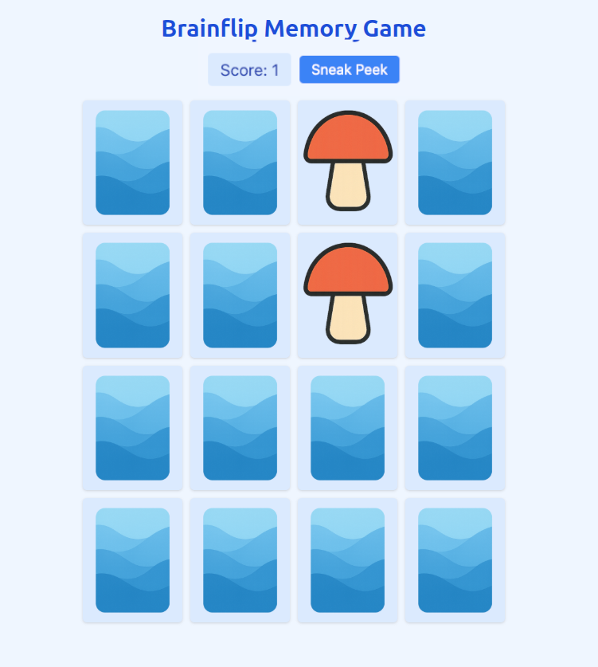

# Brainflip

Brainflip is a classic Concentration-style memory game built with Flask and vanilla JavaScript. Players flip cards on a 4×4 grid to find matching pairs, testing their memory and concentration skills. The game features a clean, responsive interface built with Tailwind CSS that works on desktop and mobile devices.



## How to Play

1. **Start the Game**: Open the application in your browser after running the Flask server
2. **Flip Cards**: Click or tap on any face-down card to reveal its image
3. **Find Matches**: Click a second card to try to find a matching pair
4. **Score Points**: When you find a matching pair, both cards stay face-up and your score increases
5. **Win the Game**: Match all 8 pairs to complete the game
6. **Play Again**: Click "Play Again" to start a new game with shuffled cards

## Features

- **Responsive Design**: Works on desktop, tablet, and mobile devices
- **Smooth Animations**: Card flipping animations with CSS transitions
- **Accessibility**: Keyboard navigation support (Tab to navigate, Enter/Space to flip cards)
- **Debug Mode**: Add `?debug=true` to the URL for ordered card layout (useful for testing)
- **Sneak Peek Helper**: Optional feature to briefly reveal all cards (see configuration below)

## Sneak Peek Feature

The game includes an optional "Sneak Peek" helper that adds a button next to the score. When clicked, it briefly reveals all face-down cards for 0.8 seconds, then hides them again. This feature can help players who want a hint or are just starting to learn the game.

### Enabling Sneak Peek

To enable the Sneak Peek feature:

1. Open the file `templates/index.html`
2. Find the line near the top of the `<script>` section:
   ```javascript
   const ENABLE_HELPERS = false;
   ```
3. Change `false` to `true`:
   ```javascript
   const ENABLE_HELPERS = true;
   ```
4. Save the file and refresh your browser

### Sneak Peek Behavior

- **Button Appearance**: A "Sneak Peek" button appears next to the score when enabled
- **Reveal Duration**: Cards are shown for 0.8 seconds (configurable via `PEEK_DURATION_MS`)
- **Cooldown Period**: After using sneak peek, the button is disabled for 2 seconds (configurable via `PEEK_COOLDOWN_MS`)
- **Game State**: Using sneak peek doesn't affect your score, matched pairs, or current turn
- **Accessibility**: The button supports keyboard navigation and screen readers
- **Smart Disabling**: The button is automatically disabled when:
  - All cards are already matched
  - A peek is currently in progress
  - The cooldown period is active
  - Cards are being compared for a match

### Customizing Sneak Peek Timing

You can adjust the timing by modifying these constants in `templates/index.html`:

```javascript
const PEEK_DURATION_MS = 800;    // How long cards stay revealed (milliseconds)
const PEEK_COOLDOWN_MS = 2000;   // Cooldown between uses (milliseconds)
```

## Installation

1. **Clone the repository:**

   ```bash
   git clone <repo-url>
   cd brainflip
   ```

2. **Install dependencies using [uv](https://github.com/astral-sh/uv):**

   ```bash
   uv sync
   ```

3. **Activate the virtual environment:**

   * **Linux/Mac:**

     ```bash
     source .venv/bin/activate
     ```
   * **Windows (cmd):**

     ```cmd
     .venv\Scripts\activate.bat
     ```
   * **Windows (PowerShell):**

     ```powershell
     .venv\Scripts\Activate.ps1
     ```

4. **Run the application:**

   ```bash
   python -m main.py
   ```


## License and Copyright

Copyright © 2025, Iwan van der Kleijn

This project is licensed under the MIT License. See the [LICENSE](LICENSE) file for details.


